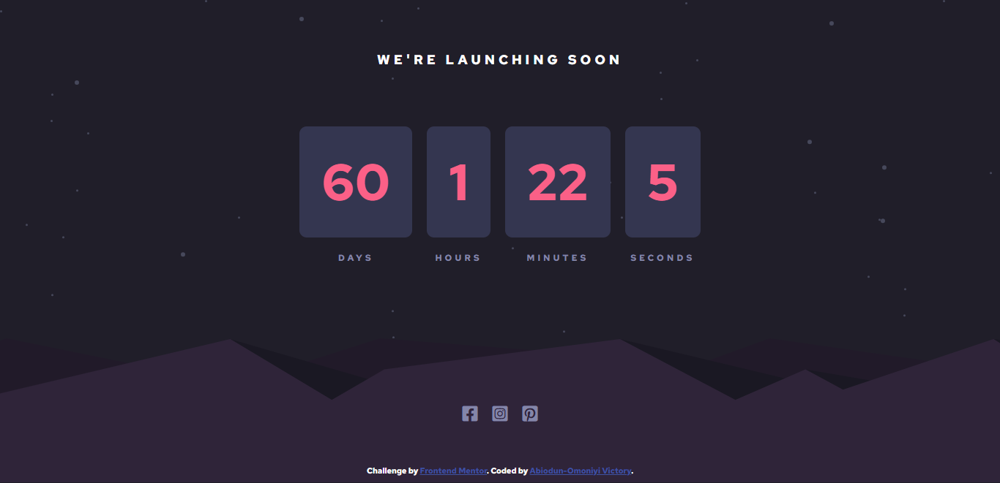
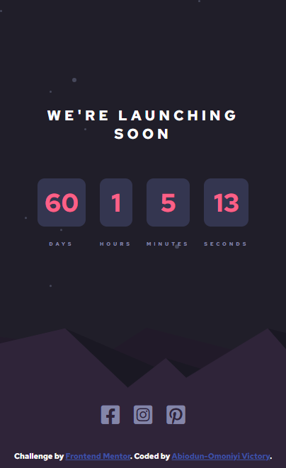

# Launch-Countdown-Timer
## Frontend Mentor - Launch countdown timer solution

This is a solution to the [Launch countdown timer challenge on Frontend Mentor](https://www.frontendmentor.io/challenges/launch-countdown-timer-N0XkGfyz-). Frontend Mentor challenges help you improve your coding skills by building realistic projects. 

## Table of contents

- [Overview](#overview)
  - [Screenshot](#screenshot)
  - [Links](#links)
- [My process](#my-process)
  - [Built with](#built-with)
  - [What I learned](#what-i-learned)
  - [Continued development](#continued-development)
  - [Useful resources](#useful-resources)
- [Author](#author)

## Overview

### Screenshot

# This is the desktop view


# This is the mobile view


### Links

- Solution URL: [View solutionhere](https://github.com/preciousvictory/Launch-Countdown-Timer.git)
- Live Site URL: [View live site here](https://preciousvictory.github.io/Launch-Countdown-Timer/)

## My process

### Built with

- Semantic HTML5 markup
- CSS custom properties
- Flexbox
- Javascript

<!-- 
### What I learned

Use this section to recap over some of your major learnings while working through this project. Writing these out and providing code samples of areas you want to highlight is a great way to reinforce your own knowledge.

To see how you can add code snippets, see below:

```html
<h1>Some HTML code I'm proud of</h1>
```
```css
.proud-of-this-css {
  color: papayawhip;
}
```
```js
const proudOfThisFunc = () => {
  console.log('🎉')
}
```

If you want more help with writing markdown, we'd recommend checking out [The Markdown Guide](https://www.markdownguide.org/) to learn more.

### Continued development

Use this section to outline areas that you want to continue focusing on in future projects. These could be concepts you're still not completely comfortable with or techniques you found useful that you want to refine and perfect.-->

### Useful resources

- [Example resource 1](https://www.w3schools.com/cssref/css3_pr_background.php) - This helped me to  understand on how add a back. I really liked this pattern and will use it going forward.
- [Example resource 2](https://blog.avada.io/css/card-hover-effects), [](https://www.w3schools.com/howto/howto_css_flip_card.asp)- This is an amazing article which helped me finally understand XYZ. I'd recommend it to anyone still learning this concept.

## Author

- Website - [Abiodun-Omoniyi Victory](https://github.com/preciousvictory)
- Frontend Mentor - [@preciousvictory](https://www.frontendmentor.io/profile/preciousvictory)
- Twitter - [@preciousvicky_](https://www.twitter.com/preciousvicky_)
